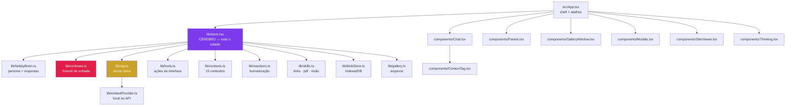
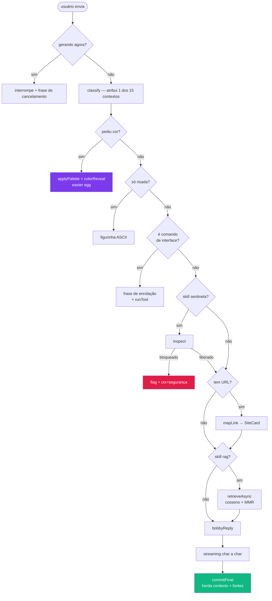
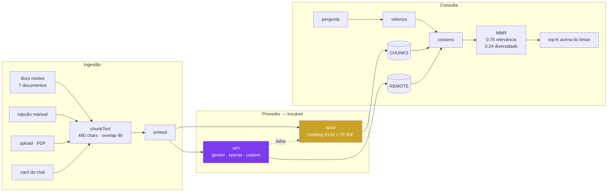
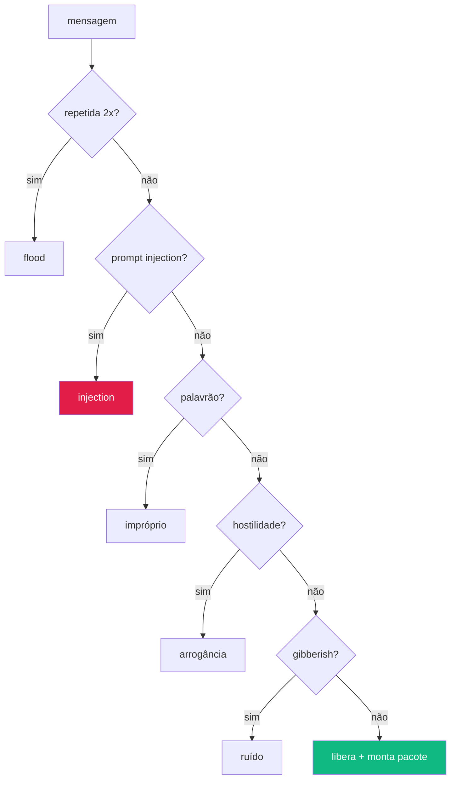
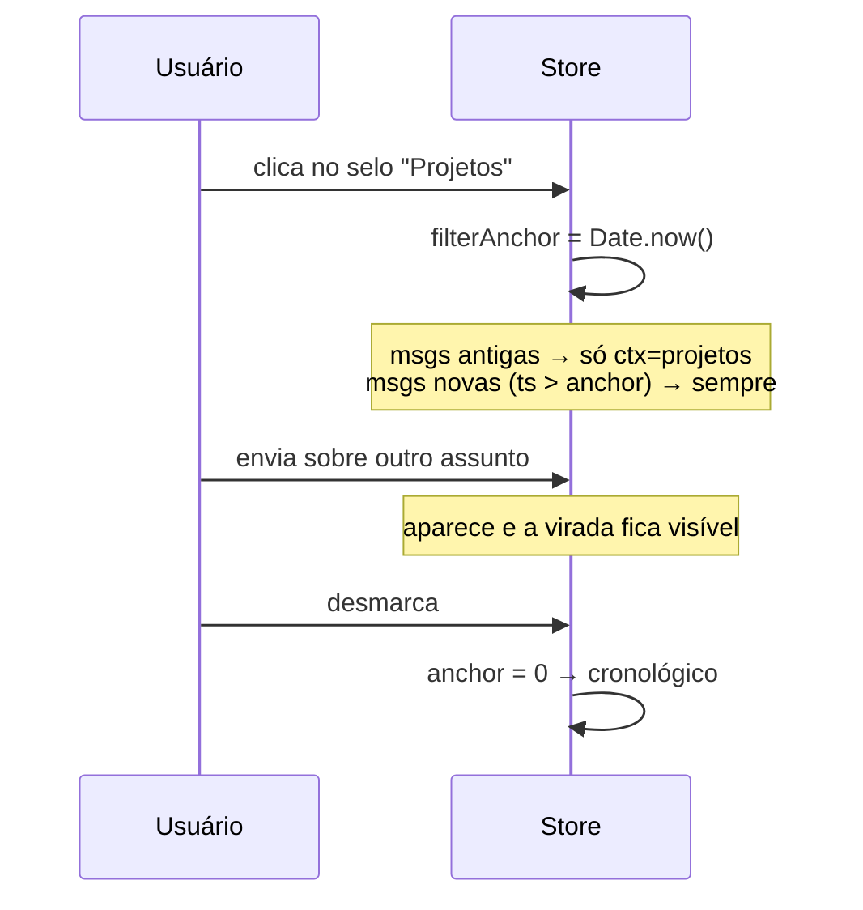
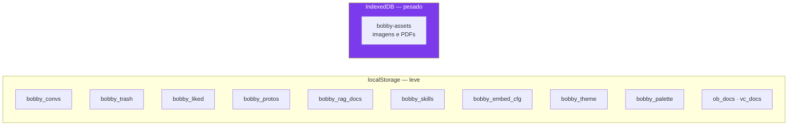
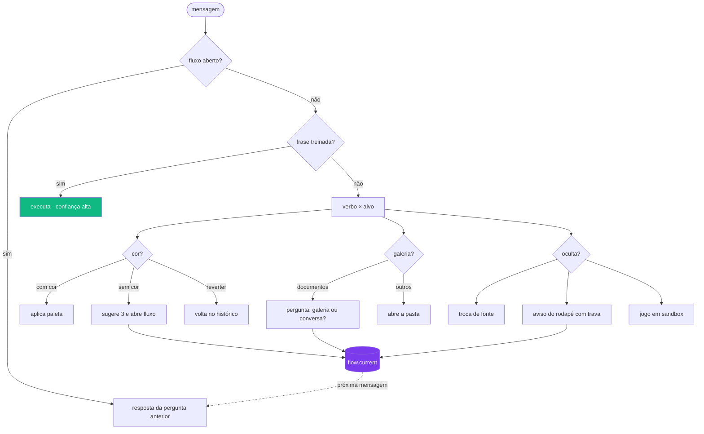

# Bobby · Render Nexus — Documentação Técnica

> Chat-portfólio de **Marcos Eduardo**, dev orquestrador de IA.
> Stack: React + Vite + TypeScript. Build single-file (`dist/index.html`).
> Tudo roda no navegador: `localStorage` + `IndexedDB`, sem servidor obrigatório.

---

## 1. Mapa de arquivos



---

## 2. Pipeline de uma mensagem

O coração do sistema é a função `send()` em `store.tsx`. Ela é um **pipeline com desvios**: a mensagem pode sair por atalhos antes de chegar ao motor.



### Estágios visíveis (Thinking)
Cada etapa emite um `Stage` que aparece na barra retrátil acima do input:

| id | rótulo | quando |
|---|---|---|
| `sent` | Sentinela filtrando → Mensagem segura | skill ligada |
| `link` | Mapeando N links | URL detectada |
| `rag` | Vetorizando consulta → Memória encontrada | skill ligada |
| `call` | Chamando Bobby → Pacote entregue | sempre |
| `think` | Bobby pensando → Resposta estruturada | sempre |
| `type` | Bobby digitando | no streaming |
| `vision` | Gemini lendo a imagem | anexo de foto |

---

## 3. RAG e embeddings



### Funções públicas — `src/lib/rag.ts`

| função | o que faz |
|---|---|
| `retrieve(q, k, threshold)` | busca síncrona no índice local |
| `retrieveAsync(q, k, threshold)` | usa índice remoto se existir; cai no local se a API falhar |
| `addDoc(title, body, tags)` | valida limites, persiste e reindexa. **Lança erro** se estourar cota |
| `removeDoc(id)` | remove com rollback se a gravação falhar |
| `exportJsonText()` | snapshot `{version, exportedAt, docs}` |
| `importJsonText(text, mode)` | valida **tudo ou nada**; `replace` ou `merge` |
| `buildRemoteIndex(cfg, onProgress)` | gera vetores via API com callback de progresso |
| `stats()` | docs, chunks, dim, provider |

**Trocar por embedding real:** só a função `embed()` muda. `cosine()` e o resto do pipeline seguem iguais.

**Contrato do endpoint próprio:**
```
POST /seu-endpoint
{ "input": "texto", "model": "nome" }
→ { "embedding": [0.1, 0.2, ...] }
```

### Limites de proteção
- documento: 250.000 caracteres
- corpus do usuário: 1.500.000 caracteres
- validação atômica: um documento inválido recusa o lote inteiro

---

## 4. Sentinela — firewall



`isGibberish()` detecta: repetição de caractere, palavra longa sem vogal, proporção de vogais < 18%, sequências de teclado (`asdf`, `qwer`…).

---

## 5. Contextos — catalogação semântica

`src/lib/contexts.ts` define **15 contextos**. A classificação acontece **na chegada** e a resposta **herda o trilho** da pergunta.

| glifo | id | quando |
|---|---|---|
| ◇ | `chat` | conversa solta |
| ◉ | `perfil` | sobre o Marcos |
| ▣ | `projetos` | cases e portfólio |
| ❰❱ | `codigo` | programação |
| ⬢ | `arquitetura` | estrutura do sistema |
| ✦ | `ia` | modelos e orquestração |
| ◐ | `design` | interface e tema |
| ▤ | `documento` | arquivos |
| ◧ | `imagem` | visão |
| ◍ | `web` | links |
| ⬡ | `dados` | RAG |
| ⚙ | `config` | skills e ações |
| ★ | `carreira` | oportunidade |
| ◈ | `ajuda` | dúvidas de uso |
| ⛨ | `seguranca` | bloqueios |

**Prioridade:** sinais estruturais (anexo, link, bloqueio, tool) vencem palavra-chave, porque são fato e não indício.

### Filtro por âncora temporal


---

## 6. Tools — a IA operando a interface

`src/lib/tools.ts` — **12 ações**, documentadas em texto que é **indexado no RAG** (doc `funcoes`).

| pedido | ação |
|---|---|
| "abre um novo chat" | `new_chat` |
| "renomeia para X" | `rename_chat` |
| "abre o histórico" | `open_history` |
| "abre a galeria" | `open_gallery` |
| "abre a base" | `open_rag` |
| "abre as skills" | `open_skills` |
| "abre a api key" | `open_apikey` |
| "expande" / "minimiza" | `expand` / `collapse` |
| "limpa o chat" | `clear_chat` |
| "desliga o sentinela" | `toggle_skill` |
| "layout 90" | `set_layout` |

`matchTool()` distingue **comando de pergunta**: "abre a galeria" executa; "o que é a galeria?" apenas explica.

---

## 7. Persistência



**Regra:** binário nunca vai para `localStorage`. `withoutInlineAssets()` remove `dataUrl` antes de salvar; o arquivo vive no IndexedDB referenciado por `assetId`.

### Limites de anexo
| tipo | limite |
|---|---|
| imagem | 5 MB |
| PDF | 8 MB |
| texto/código | 2 MB |
| por envio | 4 arquivos |

---

## 8. Humanização (`src/lib/reactions.ts`)

O que faz o Bobby parecer vivo:

| recurso | conteúdo |
|---|---|
| `STALL` | 40 frases de "deixa eu procurar" antes de abrir algo |
| `LAUGH` | 10 figurinhas ASCII de reação a risada |
| `PALETTES` | 12 cores secretas (o easter egg) |
| `typingBanter()` | provocação baseada em backspaces/tempo/caracteres |
| `IDLE_NUDGE` | 10 cutucadas para texto parado sem movimento |
| `restNudge()` | sugestão de descanso após 45 min |
| `ageLabel()` | "de 2h atrás" para mensagens antigas |

**Regra do metadado:** só dispara com **movimento real de teclado** (`keystrokes > 12`). Texto colado e abandonado cai no `IDLE_NUDGE`, não no banter.

### Easter egg das cores
`detectColor()` reconhece 12 cores em linguagem natural. `applyPalette()` reescreve as CSS vars em runtime. O Bobby responde **fingindo que descobriu na hora** — a malandragem combinada.

---

## 9. Skills (RenderLab)

Todas desativáveis, persistidas em `bobby_skills`.

| id | função |
|---|---|
| `rag` | busca vetorial |
| `sentinela` | firewall |
| `metadata` | leitura de digitação |
| `links` | mapeia páginas |
| `doccard` | cartão de arquivo |
| `pdf` | transcrição |
| `vision` | Gemini (3/sessão) |
| `proto` | gera protótipos |
| `humor` | persona |
| `turbo` | menos latência |

O Bobby **reage** a estar desligado: pediu piada com humor off, ele avisa em vez de agir por fora da configuração.

---

## 10. PENDÊNCIAS — o que foi pedido e ainda não entrou

> Ordem de prioridade sugerida para a próxima sessão.

### Concluído nesta rodada

- [x] **Nome do Bobby nas mensagens** — avatar + "Bobby · assistente"; durante o streaming vira "digitando" pulsante. Mensagem do usuário assina "Você".
- [x] **Timing repensado** — pensamento de 1,9 a 2,8 s (era 0,9 s) e digitação ~3× mais rápida (6–8 chars a cada 12 ms).
- [x] **DocViewer moderno** (`components/DocViewer.tsx`) — substitui o `DocModal`. Tem busca com contador e navegação (`Enter` / `Shift+Enter`), marcação das ocorrências, **PDF no viewer nativo** via blob, **Play** para HTML em sandbox isolado, **editor** com renome de arquivo e, ao salvar, publica "Mudanças realizadas" no chat.
- [x] **Play isolado** — `sandbox="allow-scripts allow-modals"` **sem** `allow-same-origin`: o código do usuário não alcança o app nem os dados.
- [x] **Colar texto grande vira card** — acima de 800 caracteres o conteúdo sai do input e vira anexo em espera, com contagem de caracteres e linhas.
- [x] **Colagem não conta como digitação** — `keyed: false` impede que texto colado dispare o banter de teclado.
- [x] **Botão de copiar em todos os cards** — DocCard, ProtoCard e DocViewer, sempre com ícone e confirmação visual.
- [x] **Galeria também nos cards do chat** — DocCard e ProtoCard ganharam botão que abre a janela grande.
- [x] **Protótipo confirmado por `id`** — o segundo pedido não nasce marcado por causa do primeiro.

### Alta prioridade

- [ ] **Código pequeno colado** → renderizar como bloco fechado com botão de copiar quando o usuário cola snippet curto (abaixo de 800 caracteres) direto na conversa.
- [ ] **PDF com navegação de páginas própria** — hoje delega ao viewer nativo do navegador. Falta paginação/zoom customizados e busca dentro de PDF que não teve texto extraído (precisa de OCR).

### Média prioridade

- [ ] **Barra de seleção nos itens da galeria** — marcar/desmarcar múltiplos, some ao desmarcar tudo; excluir com pop-up "não poderá recuperar"; **botão direito → mandar para a Lixeira do Chat**.
- [ ] **Renomear/apagar chat por linguagem natural** — "renomeia o terceiro chat", "apaga o chat de ontem", "exclui tudo da galeria". Exige o RAG resolver referência ordinal e por data. Deve pedir **confirmação em card sim/não** antes de destruir.
- [ ] **RAG indexar a galeria** — quando a galeria abre, os objetos dela deveriam entrar no índice para o Bobby saber o que existe lá dentro.
- [ ] **Busca no Google** — card com os 3 primeiros resultados e link para o resto. Precisa de Custom Search API (chave + CX) ou proxy, porque scraping direto esbarra em CORS.
- [ ] **Skill de internet real** — copiar o texto da página para leitura. Depende de proxy server-side (o usuário disse ter um; integrar quando enviar).
- [ ] **Cronômetro no topo** — hoje é relógio. Deveria contar **tempo de sessão aberta** e alimentar o RAG para calibrar sugestão de descanso e tratar mensagens antigas com `ageLabel()`.
- [ ] **Bug conhecido:** clicar no card de site **com a galeria aberta** causa conflito de layout (dois painéis disputando o espaço). Fechar a galeria ao abrir o SiteViewer, ou empilhar.

### Baixa prioridade

- [ ] Branch visual navegável (hoje é linear, máx. 3 tentativas).
- [ ] Importar JSON da base por arquivo (hoje só cola no editor).
- [ ] Sincronizar base com servidor/banco vetorial.
- [ ] Rate limit server-side (hoje o limite de visão é local por sessão).
- [ ] Gateway multi-provedor real para respostas do chat (hoje a API alimenta só visão e embeddings).
- [ ] Síntese das respostas por modelo real (hoje o motor local organiza os trechos do RAG).

---

## 11. Convenções do projeto

- **Ícones:** sempre `lucide-react`. Nunca emoji na interface.
- **Idioma:** português do Brasil em toda a UI e nas respostas.
- **Persona:** honesta, sem floreio. Diz "não sei" quando não há fonte.
- **Erros:** nunca engolir. Toda falha vira mensagem legível para o usuário.
- **Fallback:** toda skill precisa funcionar desligada, com aviso claro.
- **Temas:** `theme-uva` (padrão) e `theme-creme`, mais 12 paletas secretas em runtime.

---

## 12. Fechamento da rodada

- Gallery Window: selecao multipla, barra de acoes, clique direito e confirmacao destrutiva.
- Comandos naturais: renomear/apagar chat por ordinal, titulo, atual, hoje ou ontem.
- PDF binario real com jsPDF, salvo no IndexedDB e entregue como documento final.
- Google Programmable Search configuravel por chave + CX, com tres cards.
- Leitura real de pagina via Jina Reader e indexacao transitoria no RAG.
- Edicoes do Monaco atualizam o anexo original.
- Filtro de contexto recorta o pacote real do motor.
- Sensor de retorno a aba e idade de mensagem relevante.

O inventario mais atualizado esta em `Marcos Eduardo/PENDENCIAS.md`.

---

## 13. Motor de intenções e fluxo conversacional



### Como a cobertura é construída

`VERBS` guarda raiz e flexões; `TARGETS` guarda sinônimos. O cruzamento cobre
centenas de frases sem escrever cada uma. Sobre isso, o treinamento manual do
painel entra como atalho de confiança alta.

| camada | origem | prioridade |
|---|---|---|
| Treinamento manual | painel RenderLab | 1ª |
| Verbo × alvo | `intents.ts` | 2ª |
| Cor sem verbo explícito | `findColor` | 3ª |

### Fluxo conversacional

`flow.current` guarda a pergunta em aberto. Enquanto existir, a mensagem seguinte
é interpretada como **resposta**, não como comando novo. É o formulário que não
parece formulário: sem campo, sem rótulo, sem "digite aqui".

### Cores

Nenhuma tabela de hex fixa. `buildPalette(hue, sat)` deriva as dez variáveis do
tema a partir de um matiz, mantendo a mesma lógica de contraste. Por isso a IA
consegue inventar cor nova e ela nasce legível.

### Funções ocultas

| ação | quem alcança |
|---|---|
| Trocar cor | usuário e IA |
| Trocar fonte | só IA |
| Aviso do rodapé com trava | só IA |
| Jogo escondido | só IA |
| Inventar cor nova | só IA |
